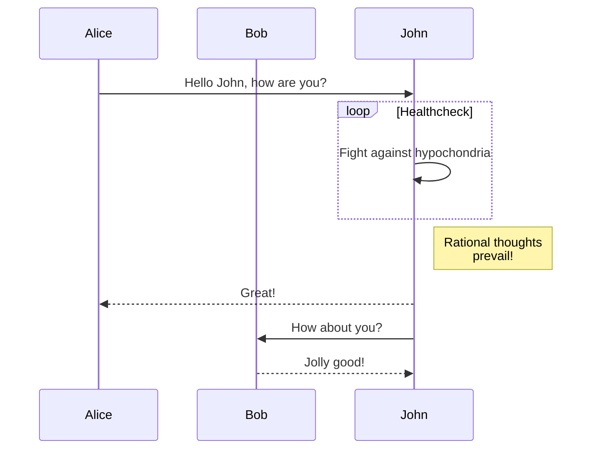

## Embedding diagrams and images

This page showcases the ability to embed diagrams and static images in documentation.

### Embedding diagrams

Diagrams can be embedded using the `embed:` syntax:

```markdown

```

See also: <https://www.structurizr.com/help/documentation/diagrams>

#### Example: Embedded diagram


### Embedding static images

Static assets can be included in the generated site, using the `--assets-dir` command-line flag. This flag can be used
with the `serve` command and the `generate-site` command.

When, for example, you would like to embed a nice picture which is located in the `pictures` directory under the assets
directory, you can do that as follows:

```markdown

```

#### Example: Embedded picture

[Sun](https://www.flickr.com/photos/schmollmolch/4937297813/), by Christian Scheja


### Embedding mermaid diagrams

Structurizr Site Generatr is supporting mermaid diagrams in markdown pages using the actual mermaid.js version. Therefore every diagram type, supported by mermaid may be used in markdown documentation files.

* flowchart
* sequence diagram
* class diagram
* state diagram
* entity-relationship diagram
* user journey
* gantt chart
* pie chart
* requirement diagram
* and some more

Please find the full list of supported chart types on [mermaid.js.org/intro](https://mermaid.js.org/intro/#diagram-types)

#### Flowchart Diagram Example

````markdown

````


#### Sequence Diagram Example

````markdown

````


