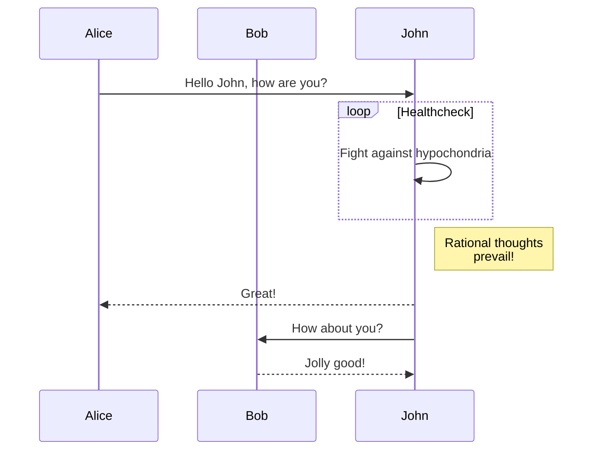

## Markdown features

This page showcases the ability to use extended markdown formating features in workspace documentation files.

### TableOfContents

`[TOC]` element which renders a table of contents

```markdown
[TOC]
```

will render into

[TOC]

### Render Tables

Standard tables can be embedded in markdown text syntax:

```markdown
| header1 | header2 |
| ------- | ------- |
| content | content |
```

This will be rendered as

| header1 | header2 |
| ------- | ------- |
| content | content |

### Admonition Blocks

Admonitions create block-styled side content.

```markdown
!!! faq "FAQ"
    This is a FAQ.
!!! attention "Warning"
    This is a warning message

!!! info "information"
    this is an additional information
```

This will be rendered as

!!! faq "FAQ"
    This is a FAQ.
!!! attention "Warning"
    This is a warning message

!!! info "information"
    this is an additional information

### GitLab flavored markdown extensions

Please see [GitLab flavored markdown features](https://docs.gitlab.com/ee/user/markdown.html?tab=Rendered+Markdown) for a detailed description.
Unfortunately only the following features are supported by Flexmark markdown renderer, that is used here.

#### Mermaid diagram support

structurizr-site-generatr is using the actual mermaid.js version. Therefore every diagram type, supported by mermaid may be used in markdown documentation files.

* flowchart
* sequence diagram
* class diagram
* state diagram
* entity-relationship diagram
* user journey
* gantt chart
* pie chart
* requirement diagram
* some more

Please find the full list of supported chart types on [mermaid.js.org/intro](https://mermaid.js.org/intro/#diagram-types)

##### Flowchart Diagram Example

````markdown

````


##### Sequence Diagram Example

````markdown

````


#### Multiline Block quote delimiters

```markdown
>>>
If you paste a message from somewhere else

that spans multiple lines,

you can quote that without having to manually prepend `>` to every line!
>>>
```

>>>
If you paste a message from somewhere else

that spans multiple lines,

you can quote that without having to manually prepend `>` to every line!
>>>

#### Inline diff (deletions and additions)

With inline diff tags, you can display `{+ additions +}` or `[- deletions -]`.

The wrapping tags can be either curly braces or square brackets:

```markdown
- {+ addition 1 +}
- [+ addition 2 +]
- {- deletion 3 -}
- [- deletion 4 -]
```

- {+ addition 1 +}
- [+ addition 2 +]
- {- deletion 3 -}
- [- deletion 4 -]

#### Math

Math written in LaTeX syntax is rendered with [KaTeX](https://github.com/KaTeX/KaTeX).
_KaTeX only supports a [subset](https://katex.org/docs/supported.html) of LaTeX._

Math written between dollar signs with backticks (``$`...`$``) or single dollar signs (`$...$`)
is rendered inline with the text.

Math written between double dollar signs (`$$...$$`) or in a code block with
the language declared as `math` is rendered on a separate line:

````markdown
This math is inline: $`a^2+b^2=c^2`$.

This math is on a separate line using a ```` ```math ```` block:

```math
a^2+b^2=c^2
```
````

This math is inline: $`a^2+b^2=c^2`$.

This math is on a separate line using a ```` ```math ```` block:

```math
a^2+b^2=c^2
```

### AnchorLink

Automatically adds anchor links to heading, using GitHub id generation algorithm

### DefinitionLists

Converts definition syntax of Php Markdown Extra Definition List to `<dl></dl>` HTML and corresponding AST nodes.

```markdown
Definition Term
: Definition of above term
: Another definition of above term
```

Definition Term
: Definition of above term
: Another definition of above term

### Emoji

Allows to create image link to emoji images from emoji shortcuts using [Emoji-Cheat-Sheet.com](https://www.webfx.com/tools/emoji-cheat-sheet) and optionally to replace with its unicode equivalent character with mapping by Mark Wunsch found at [mwunsch/rumoji](https://github.com/mwunsch/rumoji)

```markdown
thumbsup :thumbsup:  
calendar :calendar:  
warning :warning:  
```

thumbsup :thumbsup:  
calendar :calendar:  
warning :warning:  

### GfmTaskList

Enables list items based task lists whose text begins with: `[ ]`, `[x]` or `[X]`

```markdown
- [x] Completed task
- [ ] Incomplete task
  - [x] Sub-task 1
  - [ ] Sub-task 3

1. [x] Completed task
1. [ ] Incomplete task
   1. [x] Sub-task 1
   1. [ ] Sub-task 3
```

will be rendered as

- [x] Completed task
- [ ] Incomplete task
  - [x] Sub-task 1
  - [ ] Sub-task 3

1. [x] Completed task
1. [ ] Incomplete task
   1. [x] Sub-task 1
   1. [ ] Sub-task 3
